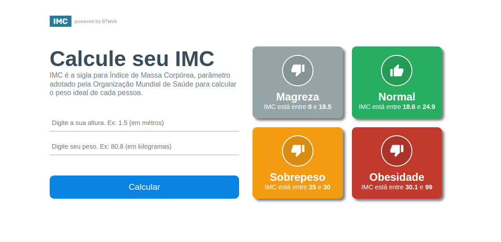

<h1 align='center'>
  
</h1>

## Sobre 📕

Projeto desenvolvido no curso de react com typescript da B7web

---

## Descrição :book:

Projeto em React + Typescript, onde foi desenvolvido uma calculadora de IMC.

---

## Tecnologias 🚀

As tecnologias utilizadas foram:

-  [REACT](https://reactjs.org/)
-  [TYPESCRIPT](https://www.typescriptlang.org/)

---

## Instalação

---

No seu terminal, rode os comandos abaixo:

```bash
$ git clone https://github.com/luizsantos85/react-app-imc.git
$ cd react-app-imc
```

Instalar depêndencias e executar o frontend:

```bash
$ npm install
$ npm start
```

Made by [@luizsantos85](https://github.com/luizsantos85) :rocket:
Viewport
Window
1455×724
1745×821
×
